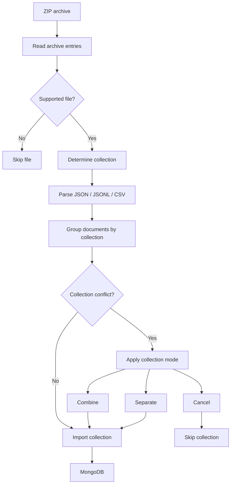
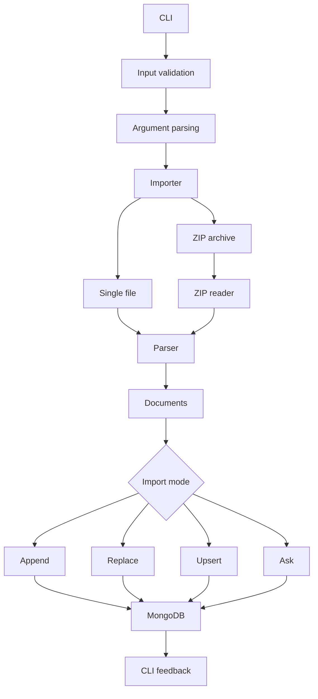

```powershell
$ abinit ~ built by Abishek Lwagun
```
# Mongo Easy

### A simple Go CLI for importing JSON, JSONL, CSV, and ZIP datasets into MongoDB.

[](https://go.dev/)
[](https://www.mongodb.com/)
[](LICENSE)

**Mongo Easy** is a command-line tool I built in Go to make importing datasets into MongoDB easier, especially when working with multiple files.

I originally started this project because I ran into a simple but annoying problem in a data analytics class: importing several datasets into MongoDB with `mongoimport` meant dealing with different files, collections, formats, and import decisions manually.

I wanted something simpler.

So I built Mongo Easy around one idea:

> **Give the user a clear choice about what should happen to the data instead of silently guessing.**

It is designed primarily as a small, practical tool for **students, developers, and anyone learning MongoDB** who wants an easier way to load datasets and experiment with MongoDB locally.

---

## What Mongo Easy Does

Mongo Easy supports:

- JSON files
- JSONL files
- CSV files
- ZIP archives containing multiple datasets
- Append imports
- Replace imports
- Upsert imports
- Automatic upsert-key detection
- Explicit upsert keys
- Multiple files targeting the same collection
- Safe handling of existing collection data
- Clear terminal feedback
- Database selection from the CLI
- Input validation before importing

The goal is not to replace MongoDB's official tools.

The goal is to make common **learning, testing, and local-development imports easier**.

---

## Why I Built It

The original motivation was a real problem I encountered while working with datasets for a data analytics class.

I had multiple files that needed to be imported into MongoDB. Some were JSON, some were CSV, and eventually I wanted to work with an entire dataset archive.

The basic workflow quickly became repetitive:

1. Figure out which file format I had.
2. Figure out which collection it belonged to.
3. Decide whether existing documents should stay.
4. Run the appropriate import command.
5. Handle files that target the same collection.
6. Check whether the import actually worked.

Mongo Easy puts those decisions behind one CLI.

It is also a project I used to learn more about:

- Go
- MongoDB
- CLI design
- File parsing
- Data validation
- Database operations
- Upsert behavior
- Software structure
- Testing

---

## Quick Example

### Replace a collection

```powershell
mongo-easy import .\sample-data\customer.json --mode replace
```

```text
Mongo Easy

• Collection: customer
• Documents ready for import: 5
• Replacing collection: customer
✔ Imported 5 documents

✔✔✔ Done.
```

### Upsert a dataset

```powershell
mongo-easy import .\sample-data\customer.jsonl --mode upsert
```

```text
Mongo Easy

Upsert key: automatic detection
• Collection: customer
• Documents ready for import: 5
• Upserting collection: customer
• Upsert key: customer_id
✔ Inserted 0, updated 0, already existed 5

✔✔✔ Done.
```

---

## Import Modes

Mongo Easy currently supports four import modes.

| Mode | What it does |
|---|---|
| `ask` | Stops when the collection already contains data and asks you to choose |
| `append` | Adds documents to the existing collection |
| `replace` | Deletes the existing collection and imports the new documents |
| `upsert` | Updates matching documents and inserts documents that do not exist |

### `ask`

This is the default behavior.

If the collection already contains documents and no explicit mode is provided, Mongo Easy does not guess what you want.

```powershell
mongo-easy import .\sample-data\customer.json
```

Instead, it tells you to explicitly choose:

```text
--mode append
--mode replace
--mode upsert
```

I added this behavior because an import tool should not unexpectedly delete or modify existing data.

---

### `append`

Adds the new documents to the existing collection.

```powershell
mongo-easy import .\sample-data\customer.json --mode append
```

---

### `replace`

Drops the existing collection and imports the new documents.

```powershell
mongo-easy import .\sample-data\customer.json --mode replace
```

Because this can remove existing data, it requires an explicit `--mode replace`.

---

### `upsert`

Upsert means:

- update a document if the key already exists
- insert it if the key does not exist

```powershell
mongo-easy import .\sample-data\customer.jsonl --mode upsert
```

Mongo Easy can automatically look for a suitable key.

The current detection order is:

```text
_id
id
customer_id
product_id
user_id
sku
email
```

A candidate key is accepted only when:

1. Every document contains the field.
2. The values are unique within the imported dataset.

If no safe key can be found, Mongo Easy stops instead of guessing.

You can also provide the key yourself:

```powershell
mongo-easy import .\sample-data\customer.jsonl --mode upsert --key customer_id
```

---

## Database Selection

Mongo Easy uses the `mongo-easy` database by default.

```powershell
mongo-easy import .\sample-data\customer.json --mode replace
```

You can choose a different database with `--database`:

```powershell
mongo-easy import .\sample-data\customer.json --database analytics --mode replace
```

The shorter `-db` option is also supported:

```powershell
mongo-easy import .\sample-data\customer.json -db analytics --mode replace
```

This makes it possible to import datasets into different MongoDB databases without changing the source code.

---

## Supported File Formats

| Format | Expected structure |
|---|---|
| JSON | One document or an array of documents |
| JSONL | One JSON document per line |
| CSV | First row contains field names |
| ZIP | Archive containing supported dataset files |

### JSON

```json
[
  {
    "customer_id": 1001,
    "name": "Alex Morgan"
  },
  {
    "customer_id": 1002,
    "name": "Sarah Johnson"
  }
]
```

A single JSON object is also supported.

### JSONL

```text
{"customer_id":1001,"name":"Alex Morgan"}
{"customer_id":1002,"name":"Sarah Johnson"}
```

### CSV

```csv
customer_id,name,email
1001,Alex Morgan,alex.morgan@example.com
1002,Sarah Johnson,sarah.johnson@example.com
```

All supported formats are converted into the same internal document representation before being sent to MongoDB.

---

## ZIP Dataset Import

One of the reasons I built Mongo Easy was to make working with a complete dataset easier.

Instead of importing each file individually, a ZIP archive can be passed directly to the tool.

```powershell
mongo-easy import .\sample-datasets.zip --mode replace --collection-mode combine
```

For example:

```text
sample-datasets.zip
├── customer.json
├── customer-update.json
├── orders.json
├── product.json
├── users.csv
└── users.jsonl
```

Mongo Easy reads the supported files inside the archive, parses them, groups them by collection, and then performs the selected import operation.

### ZIP import flow



### Collection conflicts

A conflict happens when multiple files target the same collection.

For example:

```text
users.csv
users.jsonl
```

Both target:

```text
users
```

Mongo Easy provides three options.

| Mode | Result |
|---|---|
| `combine` | Both datasets are imported into `users` |
| `separate` | Creates separate collections such as `users_csv` and `users_jsonl` |
| `cancel` | Skips that collection |

Example:

```powershell
mongo-easy import .\sample-datasets.zip --mode replace --collection-mode combine
```

---

## Project Architecture

The project is intentionally split into small packages so that parsing, database operations, importing, and terminal output are not all mixed together.

```text
mongo-easy/
├── cmd/
│   └── mongo-easy/
│       └── main.go
│
├── internal/
│   ├── cli/
│   │   ├── help.go
│   │   ├── options.go
│   │   └── options_test.go
│   │
│   ├── importer/
│   │   ├── importer.go
│   │   ├── upsert.go
│   │   ├── upsert_test.go
│   │   └── zip.go
│   │
│   ├── mongodb/
│   │   └── mongodb.go
│   │
│   ├── parser/
│   │   ├── parser.go
│   │   └── parser_test.go
│   │
│   └── ui/
│       └── ui.go
│
├── sample-data/
│   ├── customer.json
│   ├── orders.json
│   ├── product.json
│   ├── users.csv
│   └── users.jsonl
│
├── go.mod
├── go.sum
├── setup.py
├── LICENSE
└── README.md
```

### Main data flow



The main packages have separate responsibilities:

- `cli` handles command-line options and help text.
- `parser` handles JSON, JSONL, and CSV.
- `importer` controls the import workflow.
- `mongodb` contains MongoDB operations.
- `ui` handles terminal output and the import spinner.
- `main.go` connects the pieces together.

This separation also makes individual parts easier to test.

---

## Requirements

To run Mongo Easy:

- MongoDB running locally
- Windows, macOS, or Linux

The current MongoDB connection is:

```text
mongodb://localhost:27017
```

Mongo Easy uses the following database by default:

```text
mongo-easy
```

A different database can be selected with `--database` or `-db`.

For example:

```powershell
mongo-easy import .\data.json --database analytics --mode replace
```

To build Mongo Easy from source, Go is also required.

The optional Windows `setup.py` script requires Python.

## Installation

### Windows

Download and extract the Windows release of Mongo Easy.

The package contains:

```text
mongo-easy.exe
setup.py
README.md
LICENSE
```

You can run Mongo Easy directly from the extracted folder:

```powershell
mongo-easy --help
```

### Add Mongo Easy to PATH

Mongo Easy includes an optional setup script that can add the folder containing `mongo-easy.exe` to your Windows user PATH.

Run:

```powershell
python .\setup.py
```

The setup script will ask:

```text
Add Mongo Easy to your user PATH? [Y/n]:
```

Choose `Y`, then close PowerShell and open a new PowerShell window.

You can then run Mongo Easy from any directory:

```powershell
mongo-easy --help
```

For example:

```powershell
mongo-easy import "C:\path\to\data.zip" --database analytics --mode replace
```

The PATH change is made for the current Windows user and does not require administrator privileges.

---

## Build from Source

Clone the repository:

```bash
git clone <repository-url>
cd mongo-easy
```

Build the application:

```bash
go build -o mongo-easy ./cmd/mongo-easy
```

### Windows PowerShell

```powershell
go build -o mongo-easy .\cmd\mongo-easy
```

Check the available commands:

```powershell
mongo-easy --help
```

---

## Using the Sample Data

The repository includes sample datasets so the project can be tested without creating files from scratch.

### Replace

```powershell
mongo-easy import .\sample-data\customer.json --mode replace
```

### Append

```powershell
mongo-easy import .\sample-data\product.json --mode append
```

### Upsert with automatic key detection

```powershell
mongo-easy import .\sample-data\customer.jsonl --mode upsert
```

### Upsert with an explicit key

```powershell
mongo-easy import .\sample-data\customer.jsonl --mode upsert --key customer_id
```

### Import the complete sample archive

```powershell
mongo-easy import .\sample-datasets.zip --mode replace --collection-mode combine
```

A simple way to see the upsert behavior is to run a dataset with `replace` first and then run the same dataset with `upsert`.

The second import should report that the documents already existed.

---

## Validation and Errors

Mongo Easy validates the input before attempting the import.

It currently handles errors such as:

- File not found
- Dataset path is a directory
- Unsupported file type
- Invalid JSON
- Invalid JSONL
- Invalid CSV
- Unsupported import mode
- Unsupported collection mode
- Missing upsert key
- No safe automatic upsert key
- MongoDB connection failure
- MongoDB import failure

The goal is to fail clearly rather than silently doing something unexpected.

---

## Testing

Run the test suite:

```powershell
go test ./...
```

Run static analysis:

```powershell
go vet ./...
```

Format the Go source:

```powershell
gofmt -w .
```

Build the application:

```powershell
go build -o mongo-easy .\cmd\mongo-easy
```

The repository includes unit tests for:

- CLI option parsing
- JSON / JSONL / CSV parsing
- Upsert key detection

I also test the compiled CLI against real sample datasets to verify the end-to-end import behavior.

---

## Design Decisions

### Explicit import modes

Importing data can modify or delete existing documents.

Because of that, Mongo Easy does not silently decide whether the user meant append, replace, or upsert.

### Separate parser and database layers

The parser does not know about MongoDB.

The MongoDB package does not need to know whether a document came from JSON, JSONL, or CSV.

The importer connects the two.

### Safe upsert detection

An incorrect upsert key could cause the wrong documents to be updated.

Mongo Easy therefore checks that a candidate key exists in every document and has unique values before automatically using it.

### ZIP handling is separated

ZIP archives require different processing from normal files:

- opening the archive
- reading entries
- skipping unsupported files
- determining collections
- handling collection conflicts
- grouping documents

Keeping this logic separate makes the normal file-import path easier to understand.

---

## Current Limitations

Mongo Easy is currently designed for **local development, coursework, learning, and small-to-medium dataset imports**.

Current limitations include:

- MongoDB connection is currently local-only.
- Connection settings are not configurable from the CLI yet.
- Large files are read into memory.
- There is no dry-run mode yet.
- Integration testing with a real MongoDB instance is not automated yet.
- Release builds for multiple platforms are not automated yet.

These are intentional areas for future development rather than hidden limitations.

---

## What I Want to Add Next

Some of the next improvements I would like to work on:

- Configurable MongoDB connection strings
- Dry-run imports
- Better validation and error messages
- Progress reporting for large imports
- Streaming large files instead of loading everything into memory
- Integration tests against MongoDB
- CI builds
- Cross-platform release binaries
- More flexible collection naming
- Additional import formats

---

## What I Learned

This project started as a practical solution to a problem I had while working with MongoDB datasets.

Along the way, it became a way for me to work through several parts of software development in one project:

- Building a CLI in Go
- Designing package boundaries
- Parsing different data formats
- Working with the MongoDB Go driver
- Implementing replace and upsert behavior
- Handling archive-based datasets
- Designing safer destructive operations
- Writing unit tests
- Validating real end-to-end workflows
- Thinking about how a developer actually uses a tool

The most important lesson was that a useful tool does not have to be huge.

It just needs to solve a real problem well.

---

## About the Author

### Built by Abishek Lwagun

I am a backend-focused software developer interested in **Go, Java, Python, databases, distributed systems, and practical software engineering**.

I built Mongo Easy from a real workflow problem rather than as a tutorial exercise. The project gave me an opportunity to combine **Go, MongoDB, CLI development, parsing, testing, and database design** into one complete application.

I originally started the project after running into the challenge of importing multiple datasets into MongoDB during a data analytics class. What started as a small solution became a hands-on project for understanding how a developer tool can handle different file formats, database operations, validation, and user-facing CLI behavior.

If you are a student learning MongoDB or Go, I hope Mongo Easy is useful both as a tool and as an example of how a practical problem can turn into a complete software project.

[Portfolio](https://abisheklwagun.dev/) · [LinkedIn](https://www.linkedin.com/in/abisheklwagun/)

---

## License

Mongo Easy is licensed under the **MIT License**.

See [`LICENSE`](LICENSE) for the complete license text.

---

## Project Status

**Usable — active development**

Mongo Easy is currently usable for local dataset imports. Future development will focus on configuration, dry-run support, larger dataset handling, integration testing, and cross-platform release builds.

---

$ abinit ~ built by Abishek Lwagun